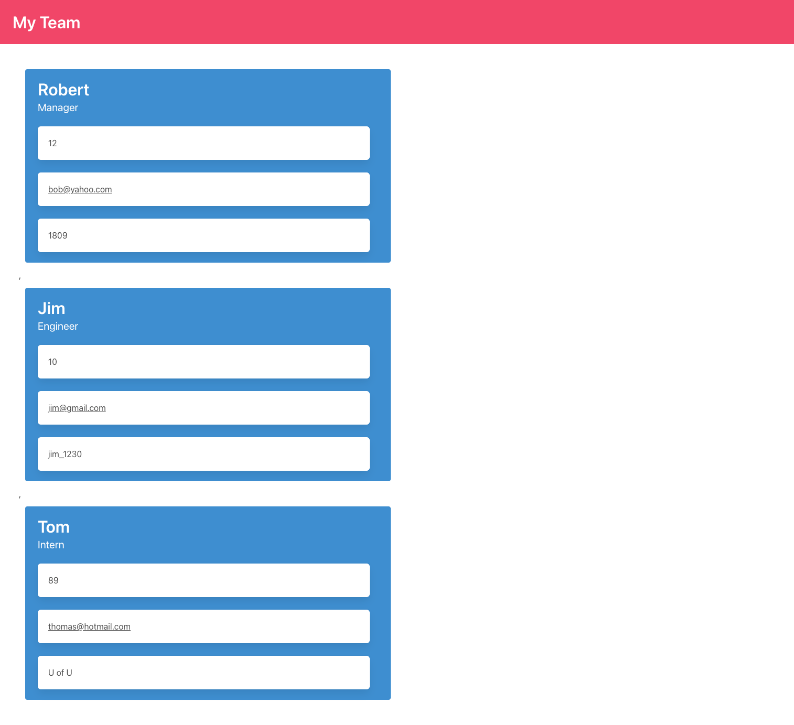

# Team Generator

## Description

This is a project to generate a team roster for ease of use later on.

## Table of Contents

- [Team Generator](#team-generator)
  - [Description](#description)
  - [Table of Contents](#table-of-contents)
  - [Installation](#installation)
  - [Usage](#usage)
  - [Credits](#credits)
  - [License](#license)
  - [Features](#features)
  - [How to Contribute](#how-to-contribute)
  - [Tests](#tests)
  - [Questions](#questions)

## Installation

Node.js is required for this to run. Find the link here: https://nodejs.org/en/download/
Inquirer is required for this package. This can be installed by running "npm i inquirer@8.2.4" in the terminal.

## Usage

Open this app to create a team with a manager, engineers, and interns.

Link to video of this program working: https://drive.google.com/file/d/163kDpDALei3IWjs8lTXV0wL_rWKWhZYn/view

## Credits

- README formatting: https://coding-boot-camp.github.io/full-stack/github/professional-readme-guide/
- Inquirer: https://www.npmjs.com/package/inquirer
- Bulma: https://bulma.io/
- Classes help: https://www.freecodecamp.org/news/javascript-classes-how-they-work-with-use-case/#use-case-description

## License

This project is under the .

## Features

This app helps to generate a team/group roster.

## How to Contribute

github or email

## Tests

Open the integrated terminal from the index.js and type "node index.js"

## Questions

Reach me through my GitHub-rtcottle here: https://github.com/rtcottle
